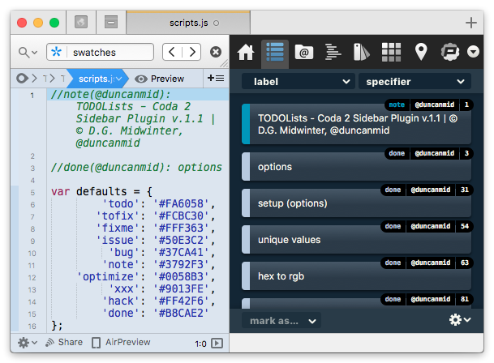

# TODOLists-WebScript-Sidebar

Coda2 webscript sidebar plugin for managing TODO comments.

## Installation

1. Download [TODOLists-WebScript-Sidebar-master.zip](https://github.com/dgmid/TODOLists-WebScript-Sidebar/archive/master.zip).
2. Unzip it.
3. Double-click the "TODOlists.codawebscriptsidebar" icon.

## License

CC-BY-NC-SA 4.0 
